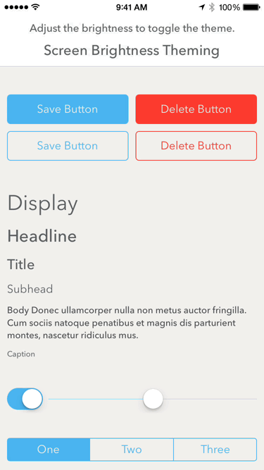

# Motif

[](https://travis-ci.org/erichoracek/Motif)

_A lightweight and customizable CSS-style framework for iOS._

## What can it do?

<!--  -->


Dynamically change your app's appearance from a user setting, as an premium feature, or even from the screen's brightness like Tweetbot or Apple Maps (pictured).

## Why should I use it?

You have an app. Maybe even a family of apps. You know about CSS, which enables web developers to write a set of declarative classes to style elements throughout their site, creating composable interface definitions that are entirely divorced from content or layout. You'll admit that you're a little jealous that things aren't quite the same on iOS.

To style your app, maybe you have a `MyAppStyle` singleton that vends styled interface components that's a dependency of nearly every view controller in your app. Maybe you use Apple's `UIAppearance` APIs, but you're limited to a frustratingly small subset of the appearance APIs. Maybe you've started to subclass some UIKit classes just to set a few defaults to create some styled components. You know this sucks, but there just isn't a better way to do things in iOS.

Well, things about about to change. Take a look at the example below to see what `Motif` can do for you:

## An example

Here's a simple example of how you'd create a pair of styled buttons with Motif. To follow along, you can either continue reading below or clone this repo and run the `Buttons Example` target within `Motif.xcworkspace`.

### The output:

<!--  -->


Your designer just sent over a spec outlining the style of a couple buttons in your app. Since you'll be using Motif to create these components, that means it's time to create a theme file.

A theme file in Motif is just a simple JSON dictionary. It can have two types of key/value pairs: _classes_ or _constants_:

- Classes: Denoted by a leading period (e.g. `.Button`), a class is a collection of named properties that correspond to values. Property values can be anything that can be represented in JSON, or alternatively references to other classes or constants.

- Constants: Denoted by a leading dollar sign (e.g. `$RedColor`), a constant is a named reference to a value. Its value can be anything that can be represented in JSON, or alternatively a reference to a class or constant.

To create the above styled buttons, we've written the following theme file:

### `Theme.json`:

```javascript
{
    "$RedColor": "#f93d38",
    "$BlueColor": "#50b5ed",
    "$H5FontSize": 16,
    "$RegularFontName": "AvenirNext-Regular",
    ".Button": {
        "textColor": "$BlueColor",
        "borderColor": "$BlueColor",
        "fontName": "$RegularFontName",
        "fontSize": "$H5FontSize",
        "contentEdgeInsets": "{10.0, 20.0, 10.0, 20.0}",
        "borderWidth": 1.0,
        "cornerRadius": 5.0
    },
    ".DestructiveButton": {
        "_superclass": ".Button",
        "textColor": "$RedColor",
        "borderColor": "$RedColor"
    }
}
```

### `ButtonsViewController.m`:

```objective-c
NSError *error;
MTFTheme *theme = [MTFTheme themeFromJSONThemeNamed:@"Theme" error:&error];
NSAssert(error != nil, @"Error loading theme %@", error);

[theme applyClassWithName:@"Button" toObject:saveButton];
[theme applyClassWithName:@"DestructiveButton" toObject:deleteButton];
```

## Where the magic happens:

### `UIView+Theming.m`:
```objective-c
+ (void)load
{
    [self
        mtf_registerThemeProperty:@"borderWidth"
        requiringValueOfClass:[NSNumber class]
        applier:^(NSNumber *width, UIView *view) {
            view.layer.borderWidth = width.floatValue;
        }];

    [self
        mtf_registerThemeProperty:@"borderColor"
        valueTransformerName:MTFColorFromStringTransformerName
        applier:^(UIColor *color, UIView *view) {
            view.layer.borderColor = color.CGColor;
        }];
}
```

### `UIButton+Theming.m`:

```objective-c
+ (void)load
{
    [self
        mtf_registerThemeProperty:@"textColor"
        valueTransformerName:MTFColorFromStringTransformer
        applier:^(UIColor *textColor, UIButton *button) {
            [button setTextColor:textColor forState:UIControlStateNormal];
    }];

    [self
        mtf_registerThemeProperties:@[
            @"fontName",
            @"fontSize"
        ] valueTransformersNamesOrRequiredClasses:@[
            [NSString class],
            [NSNumber class]
        ] applier:^(NSDictionary *properties, UIButton *button) {
            NSString *name = properties[@"fontName"];
            CGFloat size = [properties[@"fontSize"] floatValue];
            button.titleLabel.font = [UIFont fontWithName:name size:size];
        }];
}
```
